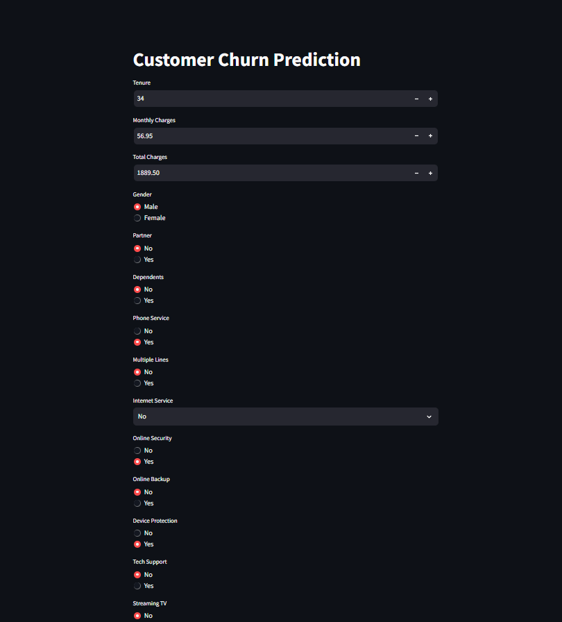

# Customer Churn Prediction Using Machine Learning

This repository contains a project aimed at predicting customer churn in the telecom industry using machine learning techniques. The project involves data preprocessing, exploratory data analysis (EDA), model training, and evaluation.

## Project Structure

- `Telecom Customer Churn.ipynb`: Jupyter notebook containing the full analysis, including data preprocessing, EDA, model training, and evaluation.
- `app.py`: Python script for deploying the machine learning model as a web application.
- `best_xg.pkl`: Serialized XGBoost model trained on the telecom customer churn dataset.

## Key Points
**Data Preprocessing**: The dataset is cleaned and preprocessed to handle missing values, encode categorical variables, and scale numerical features.
**Exploratory Data Analysis (EDA)**: Various visualizations and statistical analyses are performed to understand the relationships between features and customer churn.
**Model Training**: Multiple machine learning models are trained and evaluated, including logistic regression, decision trees, random forests, and XGBoost.
**Model Evaluation**: The models are evaluated using metrics such as accuracy, precision, recall, F1-score, and ROC-AUC score.
**Model Deployment**: The best-performing model (XGBoost) is saved and deployed as a web application using Flask.

# Sample Code
## Data Preprocessing

```
import pandas as pd
from sklearn.preprocessing import LabelEncoder, StandardScaler

# Load the dataset
data = pd.read_csv('telecom_churn_data.csv')

# Handle missing values
data.fillna(method='ffill', inplace=True)

# Encode categorical variables
label_encoders = {}
for column in data.select_dtypes(include=['object']).columns:
    label_encoders[column] = LabelEncoder()
    data[column] = label_encoders[column].fit_transform(data[column])

# Scale numerical features
scaler = StandardScaler()
numerical_features = data.select_dtypes(include=['float64', 'int64']).columns
data[numerical_features] = scaler.fit_transform(data[numerical_features])
```
## Model Training
```
from xgboost import XGBClassifier
from sklearn.model_selection import train_test_split
from sklearn.metrics import accuracy_score, classification_report

# Split the dataset into training and testing sets
X = data.drop('churn', axis=1)
y = data['churn']
X_train, X_test, y_train, y_test = train_test_split(X, y, test_size=0.2, random_state=42)

# Train the XGBoost model
model = XGBClassifier()
model.fit(X_train, y_train)

# Make predictions
y_pred = model.predict(X_test)

# Evaluate the model
print('Accuracy:', accuracy_score(y_test, y_pred))
print('Classification Report:', classification_report(y_test, y_pred))
```
## Model Deployment
```
from flask import Flask, request, jsonify
import pickle

app = Flask(__name__)

# Load the trained model
with open('best_xg.pkl', 'rb') as model_file:
    model = pickle.load(model_file)

@app.route('/predict', methods=['POST'])
def predict():
    data = request.get_json(force=True)
    prediction = model.predict([data])
    return jsonify({'prediction': int(prediction[0])})

if __name__ == '__main__':
    app.run(debug=True)
```
# Output


# Conclusion
This project demonstrates a comprehensive approach to predicting customer churn using machine learning. It covers the entire pipeline from data preprocessing to model deployment. Feel free to explore the code and adapt it to your specific needs.

